# snek-compiler

- [snek-compiler](#snek-compiler)
  - [The Snek Language](#the-snek-language)
    - [Concrete Syntax](#concrete-syntax)
      - [Syntax Descriptions (Examples)](#syntax-descriptions-examples)
        - [Simple operators](#simple-operators)
        - [Let binding](#let-binding)
        - [If statement](#if-statement)
        - [Loop and block](#loop-and-block)
        - [Function](#function)
        - [Tuple and index](#tuple-and-index)
        - [Tuple modification (new)](#tuple-modification-new)
          - [Handle cyclic values](#handle-cyclic-values)
        - [Equality (new)](#equality-new)
          - [Handle cyclic equality](#handle-cyclic-equality)
    - [Abstract Syntax (in Rust)](#abstract-syntax-in-rust)
    - [Data Representations](#data-representations)
      - [Tuple structure in heap](#tuple-structure-in-heap)
  - [Usage](#usage)
    - [Compile to assembly](#compile-to-assembly)
    - [Compile to executable binary](#compile-to-executable-binary)
    - [Run the executable](#run-the-executable)
  - [Testing](#testing)
    - [Examples](#examples)
      - [Constructing and accessing heap-allocated data](#constructing-and-accessing-heap-allocated-data)
      - [Tag-checking for heap-allocated data](#tag-checking-for-heap-allocated-data)
      - [Index out of bound](#index-out-of-bound)
      - [Index not a number](#index-not-a-number)
      - [Index wrong args](#index-wrong-args)
      - [Functions with tuples](#functions-with-tuples)
      - [Binary search tree (insert \& search)](#binary-search-tree-insert--search)
      - [Equality tests (new)](#equality-tests-new)
      - [Cyclic print (new)](#cyclic-print-new)
      - [Cyclic equality (new)](#cyclic-equality-new)
  - [References \& Credits](#references--credits)

An x86_64 compiler for snek language.

## The Snek Language

### Concrete Syntax

```plain
<prog> := <defn>* <expr>
<defn> := (fun (<name> <name>*) <expr>)
<expr> :=
    | <number>
    | true
    | false
    | input
    | <identifier>
    | (let (<binding>+) <expr>)
    | (<op1> <expr>)
    | (<op2> <expr> <expr>)
    | (set! <name> <expr>)
    | (if <expr> <expr> <expr>)
    | (block <expr>+)
    | (loop <expr>)
    | (break <expr>)
    | (<name> <expr>*)
    | (tuple <expr>+)
    | (index <expr> <expr>)
    | nil
    | (tuple-set! <expr> <expr> <expr>) (new)

<op1> := add1 | sub1 | isnum | isbool | print
<op2> := + | - | * | < | > | >= | <= | = | == (new)

<binding> := (<identifier> <expr>)
```

#### Syntax Descriptions (Examples)

##### Simple operators

```plain
(add1 x) => x + 1
(sub1 x) => x - 1
(+ x y) => x + y
(- x y) => x - y
...
```

##### Let binding

```plain
(
    let
    ((x 10) (y (add1 x)))
    (
        block
        (print x) => 10
        (print y) => 11
    )
)
```

##### If statement

```plain
(
    if
    cond_expr
    true_branch_expr
    false_branch_expr
)
```

##### Loop and block

```plain
(
    loop
    (
        block
        expr1
        expr2
        ...
        (break break_result)
    )
)
```

##### Function

```plain
(
    fun
    (fname arg1 arg2)
    (+ arg1 arg2)
)

(fname 2 3) => 5
```

##### Tuple and index

Tuple expressions are in the form as follows:

```plain
(tuple expr1 expr2 expr3 ...)
```

The index expression retrieves an element from a tuple:

```plain
(index t idx)
```

Where `t` should be a tuple and `idx` should be a number. The program checks the type dynamically. Tuples are 0-indexed.

Both C and Python support heap-allocated data while C does not check the index bound of arrays. The design of tuple in this language is more like Python than C.

Example using tuple and index:

```plain
(
    let
    ((t (tuple 0 (tuple 1 2) (tuple 3 4) nil)))
    (
        block
        (print (index t 0)) => 0
        (print (index t 1)) => (tuple 1 2)
        (print (index t 2)) => (tuple 3 4)
        (print (index t 3)) => nil
    )
)
```

##### Tuple modification (new)

Use the `tuple-set!` keyword to modify a tuple with index and value, return the tuple.

```plain
(tuple-set! t idx val)
```

Where `t` should be a tuple expr, `idx` should be a number expr, and `val` could be any valid expr. The program checks the type dynamically and throws `index out of bound` if it happens.

If a tuple becomes cyclic after modification, the printed value would be `(...)`:

```plain
(
    let
    ((t (tuple 1 2)))
    (tuple-set! t 0 t) => (tuple (...) 2)
)
```

###### Handle cyclic values

Use a vector `seen` to keep track of visited values. If the value has been visited before, print `(...)` instead.

```rust
// in snek_str(), i is a snek tuple
// deal with cyclic values
if seen.contains(&i) {
    return "(...)".to_string()
} else {
    seen.push(i);
}

let mut tuple_str = String::from("(tuple");
let addr = (i - 1) as *const u64;
let size = unsafe { *addr };
for idx in 1..=size {
    let e = unsafe { *addr.offset(idx as isize) };
    tuple_str.push_str(&format!(" {}", snek_str(e, seen)));
}
tuple_str.push_str(&format!(")"));

seen.pop();
tuple_str
```

##### Equality (new)

The `==` operator compares the structural equality of two tuples and `=` checks the reference equality if the two arguments are both tuples.

```plain
(
    let
    ((t1 (tuple 1 2)) (t2 (tuple 1 2)))
    (
        block
        (= t1 t1) => true
        (== t1 t1) => true
        (= t1 t2) => false
        (== t1 t2) => true
        (= t1 1) => type error
        (== t1 1) => type error
    )
)
```

The `==` expression raises an error if any of the two arguments is not a tuple.

###### Handle cyclic equality

Use a vector of pairs to keep track of the visited pairs of values to be compared. If the two values have already been visited before, return `true` (we are comparing the same pair again).

```rust
fn snek_eq(t1 : u64, t2 : u64, seen : &mut Vec<(u64, u64)>) -> bool {
    // deal with cyclic values
    if seen.contains(&(t1, t2)) {
        return true
    } else {
        seen.push((t1, t2));
    }

    let mut is_eq = true;
    let addr1 = (t1 - 1) as *const u64;
    let addr2 = (t2 - 1) as *const u64;
    let size1 = unsafe { *addr1 };
    let size2 = unsafe { *addr2 };
    if size1 != size2 { return false }
    for idx in 1..=size1 {
        let e1 = unsafe { *addr1.offset(idx as isize) };
        let e2 = unsafe { *addr2.offset(idx as isize) };
        if e1 != e2 {
            if (e1 & 0b11 != 1) || (e2 & 0b11 != 1) {
                is_eq = false;
                break
            } else {
                if !snek_eq(e1, e2, seen) {
                    is_eq = false;
                    break
                }
            }
        }
    }

    seen.pop();
    is_eq
}
```

### Abstract Syntax (in Rust)

```rust
enum Op1 {
    Add1,
    Sub1,
    // Neg,
    IsNum,
    IsBool,
}

enum Op2 {
    Plus,
    Minus,
    Times,
    Equal,
    Greater,
    GreaterEqual,
    Less,
    LessEqual,
    StructEqual, // new
}

enum Expr {
    Number(i64),
    True,
    False,
    Input,
    Id(String),
    Let(Vec<(String, Expr)>, Box<Expr>),
    UnOp(Op1, Box<Expr>),
    BinOp(Op2, Box<Expr>, Box<Expr>),
    If(Box<Expr>, Box<Expr>, Box<Expr>),
    Loop(Box<Expr>),
    Break(Box<Expr>),
    Set(String, Box<Expr>),
    Block(Vec<Expr>),
    Print(Box<Expr>),
    Call(String, Vec<Expr>),
    Tuple(Vec<Expr>),
    Index(Box<Expr>, Box<Expr>),
    Nil,

    TupleSet(Box<Expr>, Box<Expr>, Box<Expr>), // new
}

enum Def {
    Fun(String, Vec<String>, Expr),
}

struct Prog {
    defs: Vec<Def>,
    main: Expr,
}

```

### Data Representations

`[....]` represents the last hex digit in binary.

|Data|Representation|
|:-:|:-:|
|Numbers|`0x........ .......[...0]`|
|True|`0x00000000 0000000[0111]`|
|False|`0x00000000 0000000[0011]`|
|Tuple|`0x........ .......[..01]`|
|nil|`0x00000000 0000000[0001]`|

#### Tuple structure in heap

Tuple definition:

```plain
(tuple val1 val2 ...)
```

Heap structure:

`[size, val1, val2, ...]`

The size and elements in the tuple take 8 bytes each. `QWORD [base_addr]` retrieves the size of the tuple, `QWORD [base_addr + 8]` retrieves the first element of the tuple (index 0), etc.

Example:

```plain
(
    let
    ((t (tuple 0 1 2 3)))
    (
        block
        (index t -1) => out of bound
        (index t 0) => 0
        (index t 1) => 1
        (index t 2) => 2
        (index t 3) => 3
        (index t 4) => out of bound
    )
)
```

## Usage

Create a `.snek` file in the folder `tests`, e.g., `tests/example.snek`.

```plain
(fun (fact sofar n) (
    if
    (= n 1)
    sofar
    (fact (* sofar n) (+ n -1))
))

(fact 1 input)
```

This sample code computes `input!`, where `3!=3*2*1=6`.

### Compile to assembly

```bash
make tests/example.s
```

The assembly code is generated in `tests/example.s`.

### Compile to executable binary

```bash
make tests/example.run
```

The executable is generated in `tests/example.run`.

### Run the executable

```bash
# 10 is the input value, default is "false"
./tests/example.run 10
# output: 3628800
```

## Testing

Write test files (`.snek` files) in the `tests` directory, add entries in `tests/all_tests.rs`, and then run:

```bash
make test
```

### Examples

#### Constructing and accessing heap-allocated data

Test file: `tests/index_print.snek`

```plain
(
    let
    ((t (tuple 0 1 2 3)))
    (
        block
        (print t)
        (print (index t 0))
        (print (index t 1))
        (print (index t 2))
        (print (index t 3))
        t
    )
)
```

Index into a tuple.

Program output:

```plain
$ ./tests/index_print.run 
(tuple 0 1 2 3)
0
1
2
3
(tuple 0 1 2 3)
```

#### Tag-checking for heap-allocated data

Test file: `tests/index_not_tuple.snek`

```plain
(
    index
    input
    0
)
```

Since `input` is a number or boolean (not a tuple), the program should throw a dynamic type error.

Program output:

```plain
$ ./tests/index_not_tuple.run 
Error: invalid argument (type error)
$ ./tests/index_not_tuple.run 1
Error: invalid argument (type error)
$ ./tests/index_not_tuple.run true
Error: invalid argument (type error)
```

The program catches the error at runtime.

#### Index out of bound

Test file: `tests/index_out_of_bound.snek`

```plain
(
    index
    (tuple 1 2 3)
    input
)
```

If `input < 0` or `input > 2`, the program throws an error with message `index out of bound`.

Program output:

```plain
$ ./tests/index_out_of_bound.run -1
Error: index out of bound
$ ./tests/index_out_of_bound.run 2 
3
$ ./tests/index_out_of_bound.run 3
Error: index out of bound
```

The program catches the error at runtime.

#### Index not a number

Test file: `tests/index_not_num.snek`

```plain
(
    index
    (tuple 1 2 3)
    (tuple 2)
)
```

The index into a tuple should be a number, the program throws a dynamic type error.

Program output:

```plain
$ ./tests/index_not_num.run 
Error: invalid argument (type error)
```

The program catches the error at runtime.

#### Index wrong args

Test file: `tests/index_wrong_args.snek`

```plain
(index (tuple 1 2) 0 1)
```

The index expression accepts 2 args while the test case has 3. The program should throw a parse error.

Compiling output:

```plain
$ make tests/index_wrong_args.run
cargo run -- tests/index_wrong_args.snek tests/index_wrong_args.s
    Finished dev [unoptimized + debuginfo] target(s) in 0.25s
     Running `target/debug/snek-compiler tests/index_wrong_args.snek tests/index_wrong_args.s`
parse prog: ((index (tuple 1 2) 0 1))
parse expr: (index (tuple 1 2) 0 1)
thread 'main' panicked at 'Invalid: parse error', src/main.rs:275:22
note: run with `RUST_BACKTRACE=1` environment variable to display a backtrace
make: *** [tests/index_wrong_args.s] Error 101
```

The error is captured during the parsing procedure.

#### Functions with tuples

Test file: `tests/tuple_points.snek`

```plain
(
    fun
    (point x y)
    (tuple x y)
)

(
    fun
    (sump p1 p2)
    (
        tuple
        (+ (index p1 0) (index p2 0))
        (+ (index p1 1) (index p2 1))
    )
)

(
    let
    ((x (point 1 2)) (y (point 3 4)))
    (
        block
        (print x)
        (print y)
        (print (sump x y))
    )
)
```

Create 2 points and calculate the sum of coordinates with functions.

Program output:

```plain
$ ./tests/tuple_points.run 
(tuple 1 2)
(tuple 3 4)
(tuple 4 6)
(tuple 4 6)
```

#### Binary search tree (insert & search)

Test file: `tests/tuple_bst.snek`

```plain
(
    fun
    (insert bst val)
    (
        if
        (= bst nil)
        (tuple nil val nil)
        (
            if
            (< (index bst 1) val)
            (
                tuple
                (index bst 0)
                (index bst 1)
                (insert (index bst 2) val)
            )
            (
                tuple
                (insert (index bst 0) val)
                (index bst 1)
                (index bst 2)
            )
        )
    )
)

(
    fun
    (search bst val)
    (
        if
        (= bst nil)
        false
        (
            if
            (= (index bst 1) val)
            true
            (
                if
                (< (index bst 1) val)
                (search (index bst 2) val)
                (search (index bst 0) val)
            )
        )
    )
)

(
    let
    ((bst (tuple nil 0 nil)))
    (
        block
        (set! bst (insert bst 1))
        (set! bst (insert bst 2))
        (set! bst (insert bst -2))
        (set! bst (insert bst -1))
        (print (search bst -1))
        (print (search bst 2))
        (print (search bst 3))
        (print (search bst -3))
        bst
    )
)
```

Implements a binary search tree with `insert` and `search` methods.

The binary search tree in the example is shown in the following image.



Program output:

```plain
$ ./tests/tuple_bst.run 
true
true
false
false
(tuple (tuple nil -2 (tuple nil -1 nil)) 0 (tuple nil 1 (tuple nil 2 nil)))
```

#### Equality tests (new)

Test file: `tests/ext_equal.snek`

```plain
(
    let
    (
        (t1 (tuple 1 2))
        (t2 (tuple 1 2))
        (t3 (tuple 2 3))
    )
    (
        block
        (print (= t1 t1))
        (print (== t1 t1))
        (print (= t1 t2))
        (print (== t1 t2))
        (print (== t1 t3))
        (== t2 t3)
    )
)
```

The test file demonstrates the difference between reference equality (`=`) and structural equality (`==`).

Program output:

```plain
$ ./tests/ext_equal.run 
true
true
false
true
false
false
```

#### Cyclic print (new)

Test file: `tests/ext_cycle_print1.snek`

```plain
(
    let
    ((t (tuple 1 2)))
    (tuple-set! t 0 t)
)
```

Variable `t` is set to `(tuple t 2)`.

Program output:

```plain
$ ./tests/ext_cycle_print1.run 
(tuple (...) 2)
```

Test file: `tests/ext_cycle_print2.snek`

```plain
(
    let
    ((t1 (tuple 1 2)) (t2 (tuple t1 t1)))
    (
        block
        (tuple-set! t1 0 t2)
        t2
    )
)
```

Variable `t2` is set to `(tuple t1 t1)`, while `t1` becomes `(tuple t2 2)`.

Program output:

```plain
$ ./tests/ext_cycle_print2.run 
(tuple (tuple (...) 2) (tuple (...) 2))
```

Test file: `tests/ext_cycle_print3.snek`

```plain
(
    let
    (
        (t1 (tuple 1 2 3 4))
        (t2 (tuple -1 -2 -3))
        (t3 (tuple 0 t1 t2))
    )
    (
        block
        (print t3)
        (tuple-set! t1 0 t3)
        (tuple-set! t3 0 t3)
        (print t3)
        (tuple-set! t3 0 true)
        (tuple-set! t1 0 false)
        t3
    )
)
```

Make a tuple cyclic, print it, and then set it back to non-cyclic.

```plain
$ ./tests/ext_cycle_print3.run 
(tuple 0 (tuple 1 2 3 4) (tuple -1 -2 -3))
(tuple (...) (tuple (...) 2 3 4) (tuple -1 -2 -3))
(tuple true (tuple false 2 3 4) (tuple -1 -2 -3))
```

#### Cyclic equality (new)

Test file: `tests/ext_cycle_equal1.snek`

```plain
(
    let
    (
        (x (tuple 1 2))
        (y (tuple 1 2))
    )
    (
        block
        (tuple-set! x 0 x)
        (tuple-set! y 0 y)
        (print x)
        (print y)
        (== x y)
    )
)
```

`x = (tuple x 2)` and `y = (tuple y 2)` are both cyclic values, and they are structurally equal.

Program output:

```plain
$ ./tests/ext_cycle_equal1.run 
(tuple (...) 2)
(tuple (...) 2)
true
```

Test file: `tests/ext_cycle_equal2.snek`

```plain
(
    let
    (
        (x (tuple 1 2))
        (y (tuple 1 2))
        (z (tuple 1 x))
    )
    (
        block
        (tuple-set! x 0 x)
        (tuple-set! y 0 x)
        (print x)
        (print y)
        (== x y)
    )
)
```

`x = (tuple x 2)` and `y = (tuple x 2)` are both cyclic values, and they are structurally equal.

Program output:

```plain
$ ./tests/ext_cycle_equal2.run 
(tuple (...) 2)
(tuple (tuple (...) 2) 2)
true
```

Note that the printed results of `x` and `y` are not the same, but they are actually structurally equal, indicating that we can't use the printed string for comparing structural equality.

Test file: `tests/ext_cycle_equal3.snek`

```plain
(
    let
    (
        (x (tuple 1 1))
        (y (tuple 1 1))
        (z (tuple x 2))
        (w (tuple y 2))
    )
    (
        block
        (tuple-set! x 0 z)
        (tuple-set! y 0 y)
        (print z)
        (print w)
        (== z w)
    )
)
```

The structure of the constructed cyclic tuples are shown in the following figure.



Program output:

```plain
$ ./tests/ext_cycle_equal3.run 
(tuple (tuple (...) 1) 2)
(tuple (tuple (...) 1) 2)
false
```

Note that the printed strings are the same for `z` and `w`, but they are not structurally equal.

## References & Credits

- [Discussions on binary search tree](https://edstem.org/us/courses/38748/discussion/3125816)
